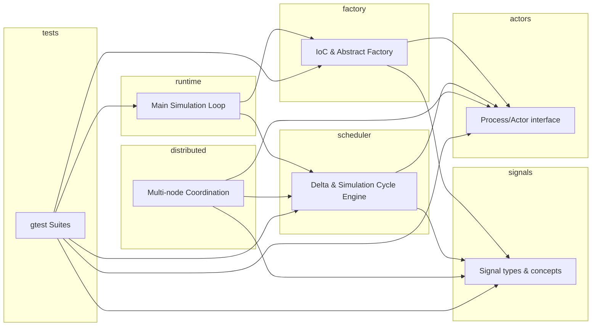

---

# **CLAUDE.md**  
## **Specification for Claude Code Integration**  
### **Actor‑Model, Signal‑Driven, VHDL‑Style Execution Engine (C++20)**

---

## **1. Purpose of This Document**
This file instructs **Claude Code** how to:

- Generate code consistent with the **PROJECT_PLAN.md**  
- Follow the **VHDL‑style execution cycle**  
- Use the **C++20 module layout**  
- Respect **IoC + abstract factory instantiation**  
- Produce **deterministic, concurrent actor code**  
- Generate **unit, functional, and integration tests**  
- Prepare for **distributed scaling**  

Claude must treat this file as the **authoritative specification** for all code generation.

---

## **2. Architectural Model (Authoritative)**

### **2.1 VHDL‑Aligned Concepts**
Claude must use VHDL terminology:

| VHDL Term | Meaning in This Project |
|----------|--------------------------|
| **Process** | Actor |
| **Signal** | Typed value with current/scheduled semantics |
| **Current value** | Value visible during delta cycle |
| **Scheduled value** | Value computed during delta cycle |
| **Transaction** | scheduled ≠ current |
| **Delta cycle** | Zero‑time event resolution cycle |
| **Simulation cycle** | Time step |
| **Sensitivity list** | Actor input signal list |

Claude must **never** use “effective/projected” terminology.  
Only **current/scheduled/transaction**.

---

## **3. Required C++20 Module Structure**

Claude must generate code using the following modules:

```
signals/
    signal_base.cppm
    signal_bool.cppm
    signal_int.cppm
    signal_concepts.cppm

actors/
    actor_base.cppm
    actor_context.cppm
    actor_registry.cppm

scheduler/
    delta_cycle.cppm
    simulation_cycle.cppm
    thread_pool.cppm

factory/
    ioc_container.cppm
    abstract_factory.cppm
    workflow_loader.cppm   (future)

runtime/
    main.cpp
    elaborated_design.cppm

distributed/ (future)
    node.cppm
    transport.cppm
    sync.cppm

tests/
    unit/
    functional/
    integration/
```

Claude must **not** invent additional modules unless explicitly instructed.

---

## **4. Signal Specification (Authoritative)**

Claude must generate signals with:

```cpp
template <SignalValue T>
struct Signal {
    T current_value;
    T scheduled_value;
    bool has_transaction;
};
```

Required operations:

- `read_current()`
- `write_scheduled()`
- `compute_transaction()`
- `commit_scheduled()`

Transactions must be computed as:

```
has_transaction = (scheduled_value != current_value)
```

---

## **5. Actor (Process) Specification**

Claude must generate actors with:

- A **sensitivity list** (vector of pointers to signals)
- A **process body** that:
  - Reads **current_value**
  - Writes **scheduled_value**
  - Performs no side effects outside signal updates

Actor execution signature:

```cpp
void execute(ActorContext& ctx);
```

Actors must be instantiated via **IoC + abstract factory**.

---

## **6. Scheduler Specification**

Claude must implement:

### **6.1 Delta Cycle Engine**
- Execute active processes concurrently  
- Compute signal transactions  
- Activate sensitive processes  
- Repeat until stable  

### **6.2 Simulation Cycle Engine**
- Commit scheduled → current  
- Advance time  
- Determine next active processes  

Claude must follow the exact VHDL semantics:

```
delta cycles resolve all transactions before time advances
```

---

## **7. Inversion of Control (IoC)**

Claude must generate:

- A registry of actor types  
- A registry of signal types  
- A dependency graph builder  
- An abstract factory that produces a **fully elaborated design**  

The elaborated design must contain:

- All actors  
- All signals  
- All sensitivity bindings  
- A scheduler instance  
- A runtime instance  

---

## **8. Workflow‑Driven Instantiation (Future)**

Claude must prepare for:

- YAML/JSON workflow descriptions  
- Dynamic actor instantiation  
- Dynamic signal instantiation  
- Graph validation  

Claude must not implement workflow parsing unless explicitly asked.

---

## **9. Testing Requirements**

Claude must generate **gtest** suites:

### **9.1 Unit Tests**
- Signals  
- Actors  
- Scheduler primitives  
- IoC container  
- Abstract factory  

### **9.2 Functional Tests**
- Multi‑actor scenarios  
- Delta cycle transitions  
- Transaction propagation  
- Fixed‑point convergence  

### **9.3 Integration Tests**
- Full elaborated design  
- End‑to‑end simulation cycles  
- Concurrency correctness  

### **9.4 Distributed Tests (Future)**  
Claude must scaffold but not implement distributed tests.

---

## **10. Formal Invariants (Claude Must Enforce)**

Claude must ensure all generated code respects:

### **10.1 Signal Invariants**
- Current value is constant during delta cycle  
- Transactions exist iff scheduled ≠ current  
- Commit correctness:  
  \[
  current_{T+\Delta} = scheduled_T
  \]

### **10.2 Process Invariants**
- Pure function of current values + internal state  
- Activated iff sensitive signal has transaction  
- No wall‑clock time dependence  

### **10.3 Delta Cycle Invariants**
- Activation set is monotonic  
- Termination when no transactions exist  
- Deterministic execution  

### **10.4 Simulation Cycle Invariants**
- Each cycle reaches a fixed point  
- All signals globally consistent at commit  
- No sensitive process is missed  

Claude must generate assertions where appropriate.

---

## **11. Mermaid Diagrams (Claude Must Use for Documentation)**

### **Execution Cycle**

```mermaid
flowchart TD

    A[Start Simulation Cycle (Time T)] --> B[Delta Cycle 1]
    B --> C[Execute Active Processes]
    C --> D[Compute Signal Transactions]
    D --> E{Any Transactions?}

    E -->|Yes| F[Activate Sensitive Processes]
    F --> B

    E -->|No| G[Delta Cycles Exhausted]
    G --> H[Commit scheduled → current]
    H --> I[Advance Simulation Time]
    I --> J{Any External Stimuli?}

    J -->|Yes| A
    J -->|No| K[Simulation Complete]
```

### **Module Relationships**



---

## **12. Claude Code Behavior Requirements**

Claude must:

- Follow this specification **exactly**  
- Never invent architecture not defined here  
- Never rename concepts  
- Always use VHDL terminology  
- Always generate deterministic code  
- Always generate modular C++20 code  
- Always generate tests aligned with invariants  
- Always generate documentation consistent with diagrams  

Claude must treat this file as **the authoritative source of truth**.

---

## **13. Output Requirements**

Claude must generate:

- C++20 modules  
- IoC container  
- Abstract factory  
- Scheduler  
- Runtime  
- Tests  
- Documentation  

Claude must not generate:

- Build systems not requested  
- Distributed runtime unless asked  
- Workflow parser unless asked  

---

## **14. Final Directive**

Claude must use **PROJECT_PLAN.md** + **CLAUDE.md** together as the **complete specification** for all code generation.

Claude must not deviate from these documents without approval.

---
