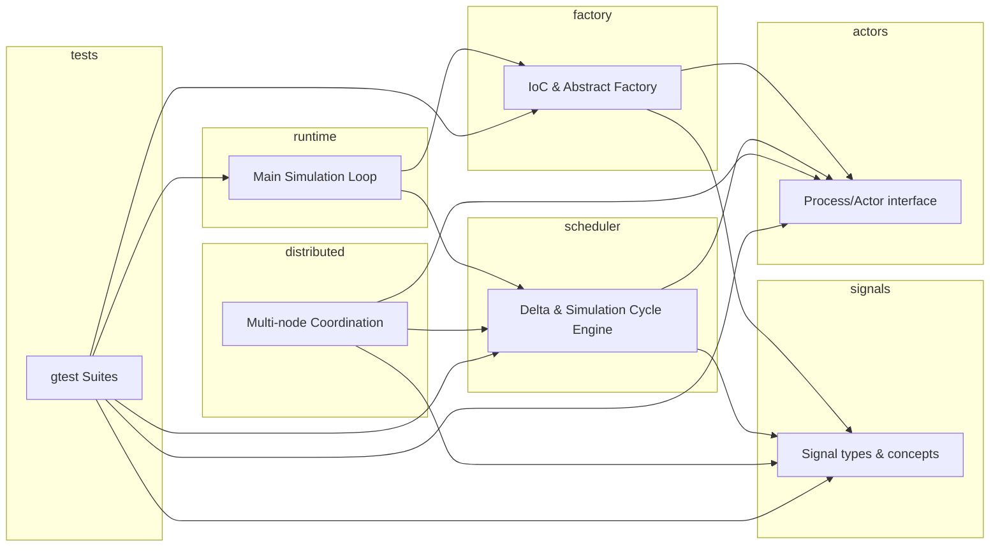
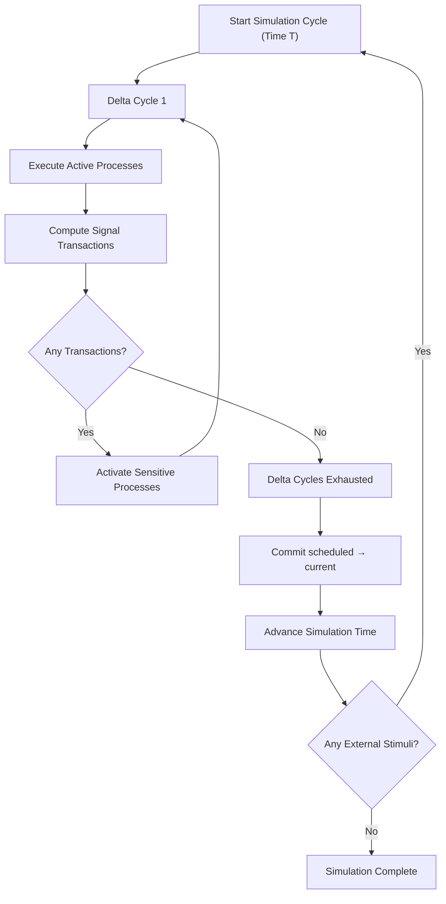
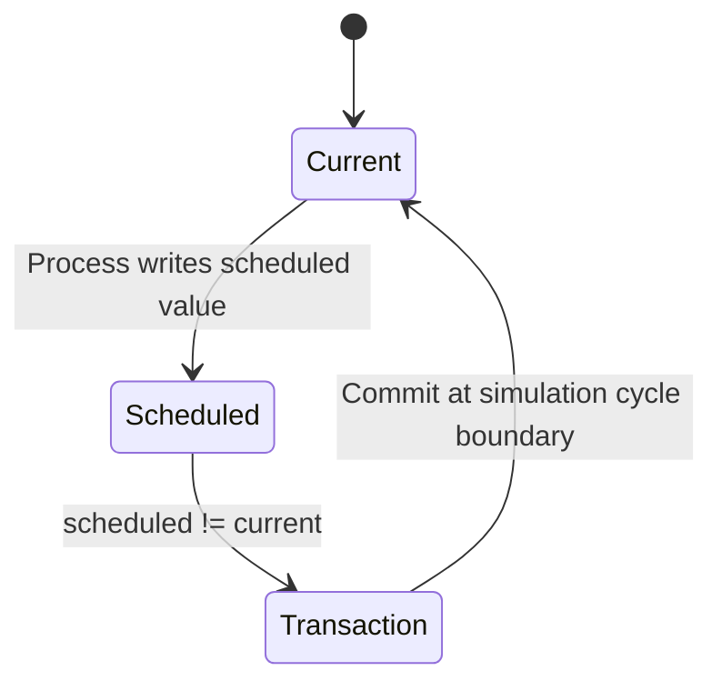
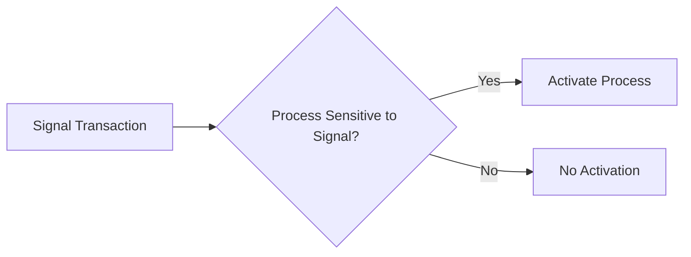
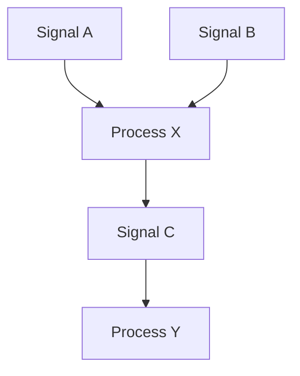

---

# **PROJECT_PLAN.md**  
## **Actor‑Model, Signal‑Driven, VHDL‑Style Execution Engine (C++20, Modular, Concurrent, Scalable)**

---

## **1. Executive Summary**
This project implements a **deterministic, concurrent, VHDL‑style signal‑driven actor system** in modern C++20. Actors (VHDL processes) execute concurrently across CPU cores, reading **current** signal values and producing **scheduled** values for the next simulation cycle. The runtime advances in discrete simulation cycles, each containing zero‑time **delta cycles** that resolve all signal transactions until the system reaches a stable state.

The system is designed for:

- High‑performance single‑process execution  
- Future horizontal scaling across multiple machines  
- Strong modularity using C++20 modules  
- Inversion of Control (IoC) for instantiation  
- Workflow‑driven elaboration (future)  
- Full gtest coverage (unit, functional, integration)

---

## **2. Architecture Overview**

### **2.1 VHDL‑Aligned Concepts**
| VHDL Concept | Project Concept |
|--------------|-----------------|
| Process | Actor |
| Signal current value | Signal current value |
| Signal scheduled value | Signal scheduled value |
| Transaction | Event (scheduled ≠ current) |
| Delta cycle | Event‑exhaustion cycle |
| Simulation cycle | Step |
| Sensitivity list | Actor input signal list |

### **2.2 Actors (Processes)**
Actors are concurrent computational units:

- Read **current** values of input signals  
- Compute **scheduled** values for output signals  
- Are activated when signals in their sensitivity list have transactions  
- Execute concurrently within each delta cycle  
- Are instantiated via IoC + abstract factory

### **2.3 Signals**
Signals are typed values with:

- **current_value** — visible during the current delta cycle  
- **scheduled_value** — computed during delta cycle, committed at simulation cycle boundary  
- **transaction** — scheduled_value ≠ current_value  

Signals satisfy a generic concept:

```cpp
template <typename T>
concept SignalValue = requires(T v) {
    { v == v } -> std::convertible_to<bool>;
};
```

### **2.4 Execution Model**
The runtime consists of:

- **Delta cycles** — resolve all signal transactions until stable  
- **Simulation cycles** — commit scheduled values and advance time  

This ensures deterministic fixed‑point convergence.

---

## **3. C++20 Module Layout**

### **3.1 Module List**
| Module | Purpose |
|--------|---------|
| `signals` | Signal types, concepts, transaction computation |
| `actors` | Actor interface, sensitivity lists |
| `scheduler` | Delta cycle engine, simulation cycle engine |
| `factory` | IoC container + abstract factory |
| `runtime` | Main simulation loop |
| `distributed` | Future multi‑node execution |
| `tests` | gtest suites |

### **3.2 Module Relationships (Mermaid)**



---

## **4. Inversion of Control (IoC)**

### **4.1 IoC Container Responsibilities**
- Register actor types  
- Register signal types  
- Bind actor input/output signals  
- Construct dependency graph  
- Produce elaborated object (fully wired design)

### **4.2 Abstract Factory**
- Instantiates actors  
- Instantiates signals  
- Binds relationships  
- Validates graph  
- Produces runnable elaborated object for `main()`

### **4.3 Workflow‑Driven Instantiation (Future)**
- Parse YAML/JSON/DSL  
- Instantiate actors dynamically  
- Bind signals  
- Validate graph  
- Output elaborated object

---

## **5. Concurrency & Scheduling**

### **5.1 Single‑Process Scheduler**
- Thread pool  
- Work stealing  
- Actor isolation  
- Deterministic delta cycle barrier  
- Event‑driven activation

### **5.2 Distributed Scheduler (Future)**
- Actor placement strategy  
- Signal replication  
- Event routing  
- Global delta cycle synchronization  
- Fault tolerance  
- Recovery and replay

---

## **6. Signal Concepts & Types**

### **6.1 Supported Types**
- `bool`  
- `int`  
- `double`  
- `std::string`  
- Domain‑specific structs  
- Custom types satisfying `SignalValue`

### **6.2 Signal Operations**
- `read_current()`  
- `write_scheduled()`  
- `compute_transaction()`  
- `commit_scheduled()`  

---

## **7. Testing Strategy (gtest)**

### **7.1 Unit Tests**
- Signal behavior  
- Actor logic  
- Scheduler primitives  
- IoC container  
- Abstract factory  

### **7.2 Functional Tests**
- Multi‑actor scenarios  
- Event propagation  
- Delta cycle transitions  
- Fixed‑point convergence  

### **7.3 Integration Tests**
- Full elaborated object  
- End‑to‑end simulation cycle  
- Concurrency correctness  
- Deterministic behavior under load  

### **7.4 Distributed Tests (Future)**
- Multi‑node actor graph  
- Network partitions  
- Event consistency  
- Delta cycle synchronization  

---

## **8. Build & Deployment**

### **8.1 CMake Structure**
- Modular targets  
- Unit tests  
- Integration tests  
- Runtime executable  
- Optional distributed components  

### **8.2 VS Code + WSL2**
- CMake Tools  
- Ninja  
- gdb  
- clang‑tidy  
- sanitizers  
- perf + flamegraphs  

### **8.3 CI/CD**
- Build  
- Test  
- Static analysis  
- Packaging  
- Artifact publishing  

---

## **9. Performance & Observability**

### **9.1 Metrics**
- Delta cycle count  
- Simulation cycle duration  
- Actor execution time  
- Transaction count  
- Convergence iterations  

### **9.2 Logging**
- Delta cycle boundaries  
- Actor activation  
- Signal transactions  
- Commit operations  

### **9.3 Profiling**
- perf  
- heaptrack  
- valgrind  
- flamegraphs  

---

## **10. Future Extensions**
- Workflow DSL  
- Distributed runtime  
- Hot‑swappable actors  
- Persistent signals  
- Replay engine  
- Deterministic simulation mode  
- Actor migration  
- GPU‑accelerated actors  

---

## **11. Glossary**
- **Process** — VHDL‑style concurrent unit (actor)  
- **Signal** — typed value with current/scheduled semantics  
- **Transaction** — scheduled_value ≠ current_value  
- **Delta cycle** — zero‑time event resolution cycle  
- **Simulation cycle** — time advancement step  
- **Elaborated object** — fully wired actor/signal graph  
- **IoC** — inversion of control  
- **Fixed point** — no further signal transactions  

---

## **12. VHDL‑Style Execution Cycle**

### **12.1 Initialization**
1. Instantiate design via IoC + abstract factory  
2. Initialize all signals  
3. Execute all processes once  
4. Compute initial transactions  
5. Activate sensitive processes  

---

### **12.2 Delta Cycle (Zero‑Time Event Resolution)**



---

### **12.3 Signal State Transition**



---

### **12.4 Process Scheduling**



---

## **13. Formal Invariants**

### **13.1 Signal Invariants**
- **Current value is constant** during a delta cycle  
- **Transactions exist iff** scheduled_value ≠ current_value  
- **Commit correctness:**  
  \[
  current_{T+\Delta} = scheduled_T
  \]

### **13.2 Process Invariants**
- Processes are **pure functions** of current values + internal state  
- A process is activated **iff** a sensitive signal has a transaction  
- No process depends on wall‑clock time

### **13.3 Delta Cycle Invariants**
- Activation set is **monotonic** (non‑increasing)  
- Termination occurs when **no transactions exist**  
- Execution is **deterministic**

### **13.4 Simulation Cycle Invariants**
- Each simulation cycle reaches a **fixed point**  
- All signals are globally consistent at commit  
- No sensitive process is missed

---

## **14. Appendix: Example Actor Graph (Mermaid)**



---

